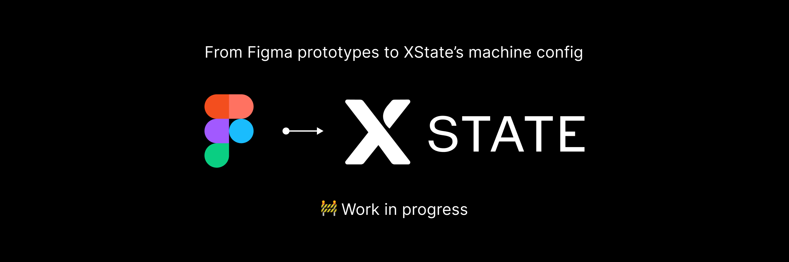

> [!NOTE]
> I stopped working on this project!
>
> - I didn't find complex-enough and valid use cases in my day-to-day working life.
> - Apart from genuine curiosity, I didn't find much interest from the community.
> - At the same time, the Figma prototype -> XState conversion is trickier than expected, due to the nested Figma prototype logic. See [discussions/10](https://github.com/NoriSte/figma-to-xstate/discussions/10) as an example.
> - I achieved the personal goal of learning about [the Figma plu-gin API](https://www.figma.com/plugin-docs/).
>    - Which resulted in me implementing a Figma plugin, [Select and Inspect](https://www.figma.com/community/plugin/1348339696557868933/select-and-inspect), as a side effect.
>       - Which allowed me to implement a Figma plugin to check if Preply's Figma files correctly use the tokens or not (it's feasible but quite complex, and it turned out that even more staffed Design System teams avoid doing it due to the maintenance load)
>          - Which got us (Preply's Design System team) decide to keep the Design System visual coverage on the engineering side. You can read more about it the dedicated article: Visual coverage: [Why and How Preply Measures the Impact of the Design System](https://medium.com/preply-engineering/visual-coverage-why-and-how-preply-measures-the-impact-of-the-design-system-1057115f4aff).

---

# 🚧 Figma to XState

A Figma plugin to convert a Figma prototype to an XState machine (work in progress).

## Why?

I trust XState not only as a powerful development tool, but also for enabling pair programming
among engineers and Product stakeholders.

Product teams do not miss much edge cases when they design
features through flowcharts and also ease a flowchart-to-XState machine conversion process. At the
same time, I think a Figma prototype to XState machine convert tool can speed up the initial
conversion process, allowing later engineering rework the state machine with or without the designers.

## Roadmap

- [x] Export Figma's frames as XState's states
- [ ] Export Figma's interactions as XState's events
  - [x] Click
  - [x] Drag
  - [ ] Key
  - [x] Mouse enter/leave
  - [x] Mouse down/up (touch down/touch up)
    - [x] Delay for all the mouse events
    - [ ] Delays that override each other
  - [ ] Set variable
    - [ ] Support for variable collections
- [ ] Export Figma's actions actions as XState's events
  - [x] Navigate
  - [ ] Change to
  - [ ] Back
  - [ ] Set variable
  - [ ] Conditional
  - [x] Scroll to
  - [ ] Open link
  - [ ] Open overlay
  - [ ] Swap overlay
  - [ ] Close overlay
- [ ] Support for multiple prototypes in the same page
- [ ] Support for custom prototype starting points (frames or elements)
- [ ] Support for frames and elements with the same name
- [ ] Export XState V5 machine

## FAQ

*Is an XState machine to Figma prototype conversion in the roadmap?*?

No, Figma's prototypes lacks most of the XState's functionalities.

*Is a two-way sync in the roadmap after the first export?*?

No, I think tracking what happened to the XState machine after it has been exported is too hard and
Figma's prototypes lacks most of the XState's functionalities.

### Install the plugin

1. In the Figma desktop app, open a Figma document.
2. Search for and run `Import plugin from manifest…` via the Quick Actions search bar.
3. Select the `manifest.json` file that was generated by the `build` script.
